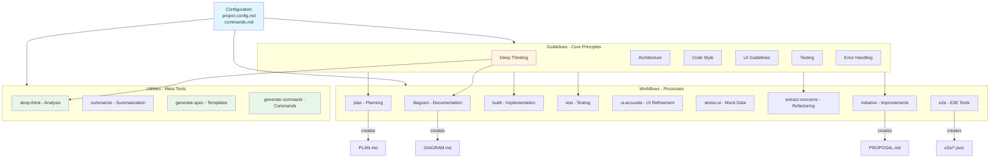
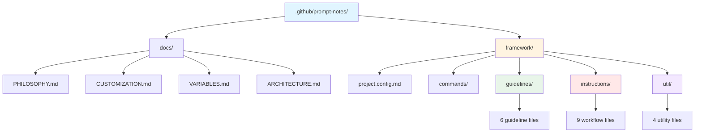

# Framework Architecture

Visual overview of the Prompt Notes framework structure and component relationships.

## Summary

The Prompt Notes framework is a structured system for AI-assisted development workflows. It consists of configuration files, reusable guidelines, workflow instructions, and utility tools organized in a portable directory structure designed to be copied into any project.

## Key Patterns
- **Variable-based paths** - All paths use `${VARIABLE}` placeholders defined in project.config.md
- **Separation of concerns** - Guidelines (principles) vs Instructions (workflows) vs Utilities (meta-tools)
- **Stack-agnostic methodology** - Core patterns remain constant regardless of tech stack
- **Self-documenting** - Each file includes inline examples and adaptation notes

## Data Flow

Configuration starts in project.config.md defining all paths and stack details. Guidelines provide the principles (deep-thinking, architecture, code-style, ui, testing, error-handling). Workflow instructions reference these guidelines and use variable placeholders to remain portable. Utility tools enable meta-operations like creating new commands or analyzing existing ones. The commands.md file serves as the entry point mapping command names to instruction files.

## Component Relationships

## Directory Structure

## File Organization

### Configuration
- `project.config.md` - Central configuration for paths, stack, and tooling
- `commands/commands.md` - Command registry mapping @commands to files

### Guidelines (6 files)
Core principles referenced by multiple workflows:
- Deep thinking methodology
- Architecture patterns
- Code style conventions
- UI guidelines
- Testing approach
- Error handling patterns

### Workflows (9 files)
End-to-end processes that produce deliverables:
- `@plan` - Feature planning
- `@build` - Implementation
- `@test` - Test generation
- `@diagram` - Architecture docs
- `@initiative` - Improvement proposals
- `@extract-concerns` - Duplication analysis
- `@ui-accurate` - UI refinement
- `@stress-ui` - Mock data
- `@e2e` - E2E tests

### Utilities (4 files)
Meta-tools for framework operations:
- `@deep-think` - Deep analysis
- `@summarize` - File summarization
- `@generate-spec` - Create templates
- `@generate-command` - Generate commands

### Documentation (4 files)
- PHILOSOPHY.md - Why and when
- CUSTOMIZATION.md - How to adapt
- VARIABLES.md - Configuration reference
- ARCHITECTURE.md - Visual framework overview

## Design Principles

**Portability**: The framework uses `${VARIABLE}` placeholders throughout all files, making it portable across different project structures. Users only need to update `project.config.md` once.

**Stack Agnostic**: While examples use React/TypeScript/MUI/GraphQL, the methodology (search patterns, compare approaches, verify steps) applies to any tech stack. Users adapt the syntax but keep the process.

**Self-Improving**: The framework includes meta-tools (`@generate-spec`, `@generate-command`) that allow users to create new workflows and commands as they discover patterns specific to their projects.

**Guidelines vs Instructions**: Guidelines define principles and are referenced by multiple workflows. Instructions are executable workflows that load relevant guidelines and produce concrete outputs (PLAN.md, DIAGRAM.md, etc.).

**Verification-Focused**: Most workflows include verification checklists and quality gates to catch issues early rather than at code review stage.
