## Architecture Diagram Generation

**CRITICAL COMMANDS** - Execute these FIRST:

```bash
# ALWAYS run this BEFORE creating new diagram
rm .github/DIAGRAM.md
```

Then create new diagram at: `.github/DIAGRAM.md`

**Guidelines Reference**:
- **Deep Thinking**: `${PROMPTS_DIR}/guidelines/deep-thinking-guidelines.md` - Pattern discovery for multi-pass analysis

---

### Scope & Detail Level

- 3-4 main layers (Context, Container, Presentation, Key Components)
- 8-12 components total
- 5-8 bullet points per component
- 10-15 critical files referenced
- Skip utilities layer unless critical

### 1. Multi-Pass Analysis (REQUIRED)

**Reference**: Applies pattern discovery methodology from `${PROMPTS_DIR}/guidelines/deep-thinking-guidelines.md`

You MUST perform **at least 3 analysis passes**:

**Pass 1: Discovery** - Locate target, entry points, direct imports, component types (use semantic_search, grep_search)
**Pass 2: Deep Context** - Data flow, patterns, GraphQL ops, utilities, conditionals  
**Pass 3: Validation** - Cross-reference, verify layers, check edge cases
**Pass 4+** (if needed) - Complex state, nested hierarchies, integrations

---
Include these layers (when applicable):

1. **CONTEXT** - Providers, hooks, constants, type guards, utilities
2. **CONTAINER** - Logic, state, GraphQL, handlers, validation, effects
3. **PRESENTATION** - Pure components, layout, composition
4. **CONTENT** - Reusable UI, forms, displays
5. **CONDITIONAL** - Type guards, feature flags, state-dependent UI

### 3. Format - Mermaid Diagrams ONLY

**ALWAYS use Mermaid** - NEVER use ASCII art.

**Diagram Types to Use**:
- **Architecture/Component Hierarchy**: `flowchart TB` (top to bottom) or `flowchart LR` (left to right)
- **User Interactions/API Calls**: `sequenceDiagram`
- **State Changes**: `stateDiagram-v2`
- **Data Flow**: `flowchart TD` or `flowchart LR`
- **Class/Type Structure**: `classDiagram`
- **Timeline/Phases**: `gantt`

**CRITICAL for Consistency**:
- ✅ **ALWAYS use `flowchart` instead of `graph`** - More stable, predictable layout
- ✅ **Use ID-based subgraphs** with bracket labels: `subgraph Layer1["LAYER 1 - Name"]`
- ✅ **Avoid special characters in labels**: No `:`, `|`, `&`, `()` in subgraph names
- ✅ **Prefer LR (left-to-right)** for complex hierarchies - more consistent than TB
- ✅ **Use consistent node IDs** - Short, uppercase, descriptive (e.g., `AUTH_PROVIDER`)

**Basic Format Example**:
````markdown

```mermaid
flowchart TB
    subgraph Layer1["LAYER 1 - Context"]
        A[ComponentName.tsx<br/>────────────<br/>• Key function 1<br/>• Key function 2<br/>• Key function 3]
        B[HookName.ts<br/>────────────<br/>• Key item 1<br/>• Key item 2<br/>• Key item 3]
    end
    
    subgraph Layer2["LAYER 2 - Container"]
        C[ContainerComponent.tsx<br/>────────────<br/>• State management<br/>• GraphQL queries<br/>• Event handlers]
    end
    
    A -->|provides data| C
    B -->|hooks into| C
```

````

**Styling Guidelines**:
- ✅ Use subgraphs for layers (Context, Container, Presentation, etc.)
- ✅ Include file names with `.tsx`/`.ts` extensions
- ✅ Use `<br/>` for line breaks within nodes
- ✅ Add descriptive relationship labels on arrows
- ✅ Use `style` commands for visual emphasis when needed
- ❌ Don't make diagrams too wide (keep readable in preview)
- ❌ Don't use quoted strings for subgraph names (use ID + bracket label)

### 4. Content Per Component

Include: File name, Purpose, 3-7 key responsibilities, important functions/methods, critical state/props, GraphQL operations, relationships.

### 5. DIAGRAM.md Structure

**Template**:

```markdown
# Architecture Diagram: [Component/Feature Name]

**Generated**: [Date]
**Target**: [File path or component name]
**Analysis Passes**: [Number]

## Summary
[2-3 sentence overview]

## Key Patterns
- [Pattern] - [Usage]

## Data Flow
[3-5 sentences on data flow]

## Component Hierarchy

```mermaid
[Mermaid diagram showing component architecture]
```

## Sequence Diagram (if applicable)

```mermaid
sequenceDiagram
    [Interaction flow for user actions/API calls]
```

## State Diagram (if applicable)


## File Reference
- `path/to/file.tsx` - [Purpose]

## Notes
[Observations, caveats, recommendations]
```

### 6. Best Practices

**DO**: ✅ Read full files, follow imports, trace props/state, include types, show GraphQL, indicate conditionals
**DON'T**: ❌ Skip passes, make assumptions, omit components, use inconsistent formatting

### 7. Sizing

- **Small** (< 5 files): Single diagram
- **Medium** (5-15 files): Single diagram with sections
- **Large** (15+ files): Multiple diagrams or hierarchical view

### 8. Verification (REQUIRED)

**CRITICAL**: Before finishing, ALWAYS verify all Mermaid diagrams render correctly:

1. **Syntax Check**: Ensure all code blocks use triple backticks with `mermaid` language identifier
2. **Diagram Validation**: 
   - Check for proper graph type declaration (`graph TB`, `sequenceDiagram`, etc.)
   - Verify all node IDs are defined before use
   - Ensure arrows use correct syntax (`-->`, `-.->`, `==>`)
   - Validate subgraph syntax (proper opening/closing)
3. **Content Verification**:
   - No stray text outside diagram blocks
   - Line breaks use `<br/>` not `\n` inside nodes
   - Special characters properly escaped
   - No unclosed brackets or parentheses
4. **Rendering Test**: Mentally parse each diagram or use Mermaid preview if available

**Common Issues to Check**:
- ❌ Missing closing ``` for code blocks
- ❌ Mixed diagram content (two diagrams merged into one)
- ❌ Invalid node syntax (missing brackets, quotes)
- ❌ Broken subgraph structure
- ❌ Corrupted file with appended/prepended content

**If Issues Found**: Fix ALL diagrams before completion. Diagrams MUST render correctly.

---

**After Creation, Report**:
```
✅ Diagram created in `.github/DIAGRAM.md`
✅ All Mermaid diagrams verified and rendering correctly
📊 [X] files across [Y] passes
🎯 [Z] components documented
```
